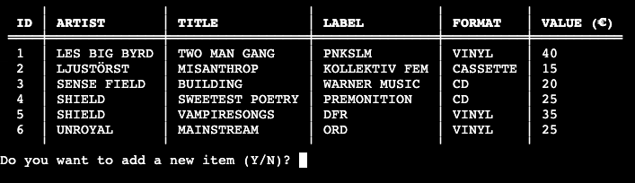

# **WOM Record Collection**
'WOM Record collection' is an application that helps you catalog your music collection. Examples of functions are *listing the collection*, *adding / changing / removing items in the collection*, *sorting the collection* and *calculating the total value of the collection*. The application targets users with an interest of collecting music that have a need of keeping track of their collection.

[View live website here](https://project-portfolio-3.herokuapp.com/)

# Table of Content

* [**Project**](<#project>)
    * [Site Users Goal](<#site-users-goal>)
    * [Site Owners Goal](<#site-owners-goal>)

* [**User Experience (UX)**](<#user-experience-ux>)
    * [Site Structure](<#site-structure>)
    * [Flow chart](<#flow-chart>)
    * [Data Model](<#data-model>)
    * [Design Choices](<#design-choices>)

* [**Features**](<#features>)
    * [List Collection](<#list-collection>)
    * [Search Item In Collection](<#search-item-in-collection>)
    * [Add Item To Collection](<#add-item-to-collection>)
    * [Edit Item In Collection](<#edit-item-in-collection>)
    * [Remove Item From Collection](<#edit-item-in-collection>)
    * [Sort Collection](<#sort-collection>)
    * [Show Total value of collection](<#show-total-value-of-collection>)

* [**Features Left To Implement**](<#features-left-to-implement>)

* [**Technologies Used**](<#technologies-used>)
    * [Languages](<#languages>)
    * [Frameworks, Librarys & Software](<#frameworks-libraries--software>)

* [**Testing**](<#testing>)
  * [Code Validation](<#code-validation>)
  * [Responsiveness Test](<#responsiveness-test>)
  * [Browser Compatibility](<#browser-compatibility>)
  * [Additional Testing](<#additional-testing>)
  * [Known Bugs](<#known-bugs>)
* [Deployment](<#deployment>)
* [Credits](<#credits>)
* [Acknowledgements](<#acknowledgements>)

#   Project

## **Site Users Goal**
The user of 'WOM Record Collection' wants to have access to an intuitive application that keeps track on the users record collection.

## User Stories
I have included some user stories to clarify why particular feature matters. This can then be tested in the [Testing](<#testing>) section.

- As a user I want to be able to have access to a list function so that I can list all items in the collection.
- As a user I want to have access to a search function to be able to search for specific items in the collection.
- As a user I want to be able to add items to the collection.
- As a user I want to be able to edit items in the collection.
- As a user I want to be able to remove items in the collection.
- As a user I want to be able to sort the collection on different sorting criterias.
- As a user I want access to a function that shows the total value of the collection.
- As a user I want have an easy way of getting back to the main menu.

## **Site Owners Goal**
The goal of the site owner is to deliver an application where the user, in an easy way, can access a record collection and with easy commands have access to relevant functions to change the content of the collection.

[Back to top](<#table-of-content>)

# User Experience (UX)

For this project I didn't make a wireframe in [Balsamiq](https://balsamiq.com/) as in the earlier projects. The reason is the 'WOM Record Collection' application will have a command line interface which means that there will not be room for that many creative design choices. Instead I decided to create a logic [Flow Chart](<#flow-chart>) to get a broad understanding of the application flow.

## Flow chart
The flow chart for this application was made with the online service [Lucid App](https://lucid.app/). I tried to keep in on a quite general level but with enough details to get a good understanding of how everything in the application is connected. The flow chart made it a lot more easy when going into the coding phase.

[Back to top](<#table-of-content>)

## Site Structure

The 'WOM Record Collection' is a terminal based application that is being presented in a one page website. When the application starts the user will be presented with a short welcome message and a menu with 8 options/areas (whereof 1 choice is to exit the application.). The menu consists of the following choices: *list collection*, *search item in collection*, *add item to collection*, *edit item in collection*, *remove item from collection*, *sort collection*, *show total value of collection* and *exit application*. Read more about the different choices in the [Features](<#features>) section.

In the top of the page there is also a 'Run Program' button that the user can use to reload the application if needed.

## Data Model
To store all data in the application I made a choice to use [Google Sheets](https://www.google.co.uk/sheets/about/). All data in the application retrievs and sends data to to the Google Sheet and the workbook includes 1 worksheet.

* Name of workbook: *music collection*
* Name of worksheet: *collection*

The worksheet holds 5 columns with information such as: *ID*, *Artist*, *Title*, *Label*, *Format* and *Value (€)* that is being fully controlled from the application via Python.

## Design Choices

* ### Color Scheme
'WOM Record Collection' is a terminal based application which means that there aren't that many visual design choices. I have though used the [Rich](https://rich.readthedocs.io/en/stable/introduction.html) for Python to be able to extend the design opportunities.

I have tried to use as clean colors as possible (see below):

* Dark Orange 3 is being used for the welcome message.

* Cyan 2 is being used for the main menu.

* Red 3 is being used for all error messages.

* Green 3 is being used for all success messages.

* ### Typography
No specific typography is being used in the application. The font is just the standard font that is being used in the terminal.

[Back to top](<#table-of-content>)

# **Features**
When the application starts it calls the *main function* which *clears the screen*, *prints the welcome message* and *lists the menu*. As stated in the [Site Structure](<#site-structure>) area the application consists of 7 different areas (functions) and an exit option, *list collection*, *search item in collection*, *add item to collection*, *edit item in collection*, *remove item from collection*, *sort collection*, *show total value of collection* and *exit application*. Read more about the different choices in the [Features](<#features>) section. The features is being explained more in detail in the [Existing Features](<existing-features>) area below.

## **Existing Features**

### **Main Menu**

### **List Collection**
The list collection function simply lists the music collection by retrieving all data from the Google Sheet 'collection'. Before listing the collection the function *add id* is being called to add an numeric ID to each row in the first column in the sheet. This needs to be done to make sure that every item has an ID so that the other functions in the application can keep track on the items in the collection. When the adding of the ID:s is done the *create table* function is being called to plot out the table columns and rows. The table functionality is a part of the [Rich](https://rich.readthedocs.io/en/stable/introduction.html) Python library. When the list is being fetched from the Google Sheet a progress indicator is being shown to the user.

### **Search Item In collection**
The search item in collection function lets the user to search for a specific item in the collection. The user can search for anything and if the item exists in the collection it's being printed out in a table (this works for multiple items as well). If no match is being found an empty table and an error message will appear. In both cases (match / no match) the user gets the possibility to add a new search credential and also go back to the main menu by choosing '0'. The search function is not case sensitive but only works with an  **exact** match of the words/numbers in the collection.

*Search credential provided by user:*

*We have a match!*

*We have no match!*

[Back to top](<#table-of-content>)

### **Add Item To Collection**
The add item to collection function let's the user add own items to the collection. The user first gets the question if they want to add an item. If they choose *no* they will be sent back to the main menu and if they answer *yes* the input sequence starts. The user provides data for all columns(*Artist*, *Title*, *Label*, *Format* and *Value (€)*). The ID column is not necessary for the user to fill in, that is being handled by the application itself. The function also checks for valid user input in each cell to secure that not empty content is being exported to the Google Sheet. If all the user input is correct it is being exported to the Google Sheet and then the table updates. After that the user will get the add item uestion again.

*Add item question*

*Add item sequence*

*Add item sequence where user doesn't add correct input (strings)*

*Add item sequence where user doesn't add correct input (int)*

### **Edit Item In Collection**
The edit item in collection function let's the user edit a specific item in the collection by choosing the ID for the item (or choose '0' to get back to the main menu). When the user has provided the ID the user needs to choose a value to edit. The ID column is not visible in the table because it's being updated by the application itself. When the user feeds in the input the update cell function is being called for validation to secure that not empty content is being exported to the Google Sheet. If the user input is correct it is being exported to the Google Sheet and then the table updates. After that the user will be redirected to the edit menu agin.

*Users ID Choice*

*Users Choice Of Value To Edit*

*Edit item where user doesn't add correct input (strings)*

*Edit item sequence where user doesn't add correct input (int)*

### Features Left to Implement

* To be updated

[Back to top](<#table-of-content>)

# Technologies Used

## Languages

* [Python](https://en.wikipedia.org/wiki/Python_(programming_language)) - provides the the functionality for the application.

## Frameworks, Libraries & Software

* [Github](https://github.com/) - used to host and edit the website.
* [Gitpod](https://www.gitpod.io/#get-started) - used to deploy the website.
* [Lighthouse](https://developer.chrome.com/docs/lighthouse/overview/) - used to test performance of site.
* [Responsive Design Checker](https://www.responsivedesignchecker.com/) - used for responsiveness check.
* [Wave Web Accessibility Evaluation Tool](https://wave.webaim.org/) - used to validate the sites accessibility.

[Back to top](<#table-of-content>)

# Testing

## Code Validation
To be updated...
  been tested through [W3C Markup Validaton Service](https://validator.w3.org/), [W3C CSS Validaton Service](https://jigsaw.w3.org/css-validator/) and [JSHint](https://jshint.com/). Errors were found on index.html in the W3C Markup Validaton Service but could quite easily be fixed (see [bugs section](#known-bugs)).

### Markup Validation
The Markup validator result, after fixing the minor errors can be seen below:

* Home Page

No errors were returned when passing through the official W3C validator.

[Back to top](<#table-of-content>)

### CSS Validaton
The CSS validator results can be seen below:

No errors were returned when passing through the official W3C validator.

[Back to top](<#table-of-content>)

### JSHint
The JSHint validator results can be seen below:

No errors were returned when passing through JSHint (*script.js*, *audio.js*, *modals.js*) but all tests reported issues connected to unused and undefined variables. These issues are not valid as the variables are used in other JavaScript files.

* script.js

* audio.js

* modals.js

[Back to top](<#table-of-content>)

# Responsiveness Test

The responsive design tests were carried out manually with [Google Chrome DevTools](https://developer.chrome.com/docs/devtools/) and [Responsive Design Checker](https://www.responsivedesignchecker.com/).

| Desktop    | Display <1280px       | Display >1280px    |
|------------|-----------------------|--------------------|
| Render     | pass                  | pass               |
| Images     | pass                  | pass               |
| Links      | pass                  | pass               |

| Tablet     | Samsung Galaxy Tab 10 | Amazon Kindle Fire | iPad Mini | iPad Pro |
|------------|-----------------------|--------------------|-----------|----------|
| Render     | pass                  | pass               | pass      | pass     |
| Images     | pass                  | pass               | pass      | pass     |
| Links      | pass                  | pass               | pass      | pass     |

| Phone      | Galaxy S5/S6/S7       | iPhone 6/7/8       | iPhone 12pro         |
|------------|-----------------------|--------------------|----------------------|
| Render     | pass                  | pass               | pass                 |
| Images.    | pass                  | pass               | pass                 |
| Links      | pass                  | pass               | pass                 |

*Comment: Scrolling is needed to some extent on some of the smaller screens*

[Back to top](<#table-of-content>)

## Browser Compatibility

'Memory of Queen Oblivion' was tested for responsiveness, functionality and appearance in the following browsers on desktop, tablet and phone with no visible issues for the user.

* Google Chrome Version (103.0.5060.114)
* Mozilla Firefox (version 102.0.1)
* Min (version 1.25.1)
* Apple Safari (version 15.5)
* Microsoft Edge (version 103.0.1264.62)

[Back to top](<#table-of-content>)

## Additional Testing

### WAVE

[WAVE](https://wave.webaim.org/) was used to check accessibility. 0 errors and 1 alerts was found. The alert was connected to page lacking a h1 (which is not a problem because the game has a headline image).

[Back to top](<#table-of-content>)

### Lighthouse
[Google Lighthouse](https://developers.google.com/web/tools/lighthouse) in Chrome Developer Tools was used to test the application within the areas of *Performance*, *Accessibility*, *Best Practices* and *SEO*. The testing showed that the *Accessability*, *Best Practices* and *SEO* was 100%. The Performance fluctuated between 75 and 90. To handle this I first compressed the *.png files and then also converted them to *.webp. After that I managed to squeeze the performance up to 88. I think the performance also is affected by the external scripts (connected to i.e. Bootstrap).

[Back to top](<#table-of-content>)

### Peer Review
Additional testing of the application was conducted by people outside of the software development field. Some spelling and grammar errors were found and corrected. No issues connected to gaming experience and visual design was reported. Template was used to control the different levels scenarios (see image below).

## Known bugs

### Fixed Bugs

**2022-08-19**
* Bug: To be updated

### Unfixed Bugs

**2022-08-20**
* Bug: To be updated

[Back to top](<#table-of-content>)

# Deployment

## To Deploy The Project
The site was deployed to GitHub pages. The steps to deploy are as follows:

1. In the GitHub repository, navigate to the Settings tab

[Back to top](<#table-of-content>)

2. Go to the Pages link in the left menu

[Back to top](<#table-of-content>)

3. From the source section drop-down menu, select the main branch (can be master in some cases but for me it was main)

4. Once the main branch has been selected, the page will be automatically refreshed and information about successful deployment / publishing can be seen on screen. The live link can be found [here](https://worldofmarcus.github.io/project-portfolio-2/).

[Back to top](<#table-of-content>)

## How To Fork The Repository On GitHub

It is possible to do a copy of a GitHub Repository by forking the GitHub account. The copy can then be viewed and it is also possible to do changes in the copy without affecting the original repository. To fork the repository, take these steps:

1. After logging in to GitHub, locate the repository. On the top right side of the page there is a 'Fork' button. Click on the button to create a copy of the original repository.

[Back to top](<#table-of-content>)

## Create A Local Clone of A Project

To create a local clone of your repository, follow these steps:

1. When you are in the repository, find the code tab and click it.
2. To the left of the green GitPod button, press the 'code' menu. There you will find a link to the repository. Click on the clipboard icon to copy the URL.
3. Use an IDE and open Git Bash. Change directory to the location where you want the cloned directory to be made.
4. Type 'git clone', and then paste the URL that you copied from GitHub. Press enter and a local clone will be created.

[Back to top](<#table-of-content>)

# Credits

## Content

* All text content written by Marcus Eriksson.

* All the icons on the website were taken from [Font Awesome](https://fontawesome.com/).

* [Template](https://github.com/Code-Institute-Solutions/readme-template) for read.me provided by Code Institute (*with some additional changes that my mentor [Precious Ijege](https://www.linkedin.com/in/precious-ijege-908a00168/))* suggested.

## Technical

To be updated

* onLoad modal function taken from [Stack Overflow](https://stackoverflow.com/questions/10233550/launch-bootstrap-modal-on-page-load).

# Acknowledgements
The application 'WoM Record Collection' was completed as the Portfolio Project #2 (*JavaScript*) for the Full Stack Software Development Diploma at the [Code Institute](https://codeinstitute.net/). I would like to thank my mentor [Precious Ijege](https://www.linkedin.com/in/precious-ijege-908a00168/) for relevant feedback during the project.

*Marcus Eriksson 2022-08-xx.*

[Back to top](<#table-of-content>)