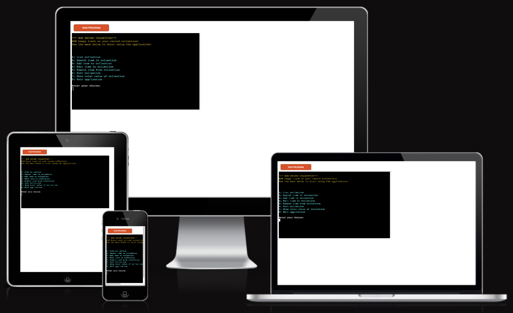
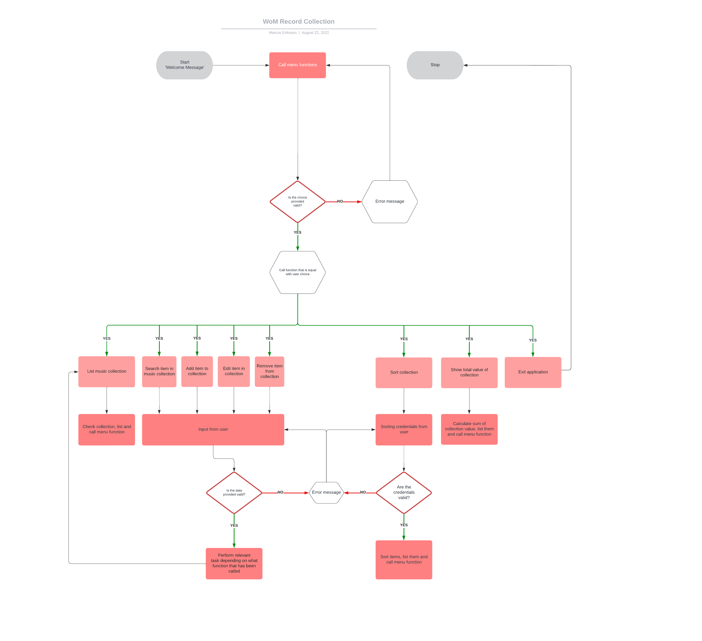
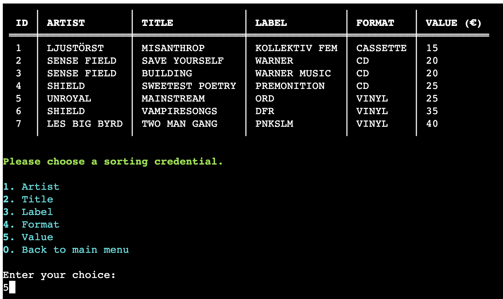

# **WOM Record Collection**
'WOM Record Collection' is an application that helps you catalog your music collection. Examples of functions are *listing the collection*, *adding / changing / removing items in the collection*, *sorting the collection* and *calculating the total value of the collection*. The application targets users with an interest of collecting music that have a need of keeping track of their collection.

[View live website here](https://project-portfolio-3.herokuapp.com/)

# Table of Content

* [**Project**](<#project>)
    * [Site Users Goal](<#site-users-goal>)
    * [User Stories](<#user-stories>)
    * [Site Owners Goal](<#site-owners-goal>)

* [**User Experience (UX)**](<#user-experience-ux>)
    * [Site Structure](<#site-structure>)
    * [Flow chart](<#flow-chart>)
    * [Data Model](<#data-model>)
    * [Design Choices](<#design-choices>)

* [**Features**](<#features>)
    * [List Collection](<#list-collection>)
    * [Search Item In Collection](<#search-item-in-collection>)
    * [Add Item To Collection](<#add-item-to-collection>)
    * [Edit Item In Collection](<#edit-item-in-collection>)
    * [Remove Item From Collection](<#edit-item-in-collection>)
    * [Sort Collection](<#sort-collection>)
    * [Show Total value of collection](<#show-total-value-of-collection>)

* [**Features Left To Implement**](<#features-left-to-implement>)

* [**Technologies Used**](<#technologies-used>)
    * [Languages](<#languages>)
    * [Frameworks, Librarys & Software](<#frameworks-libraries--software>)

* [**Testing**](<#testing>)
  * [Code Validation](<#code-validation>)
  * [Responsiveness Test](<#responsiveness-test>)
  * [Browser Compatibility](<#browser-compatibility>)
  * [Additional Testing](<#additional-testing>)
  * [Known Bugs](<#known-bugs>)
* [Deployment](<#deployment>)
* [Credits](<#credits>)
* [Acknowledgements](<#acknowledgements>)

# **Project**

## Site Users Goal
The user of 'WOM Record Collection' wants to have access to an intuitive application that keeps track on the users collection.

## User Stories
I have included some user stories to clarify why particular feature matters. These will then be tested and confirmed in the [Testing](<#testing>) section.

- As a user I want to be able to have access to a list function so that I can list all items in the collection.
- As a user I want to have access to a search function to be able to search for specific items in the collection.
- As a user I want to be able to add items to the collection.
- As a user I want to be able to edit items in the collection.
- As a user I want to be able to remove items in the collection.
- As a user I want to be able to sort the collection on different sorting criterias.
- As a user I want access to a function that shows the total value of the collection.
- As a user I want have an easy way of getting back to the main menu.

## Site Owners Goal
The goal of the site owner is to deliver an application where the user, in an easy way, can access a record collection and with easy commands have access to relevant functions to change the content of the collection.

[Back to top](<#table-of-content>)

# **User Experience (UX)**

For this project I didn't make a wireframe in [Balsamiq](https://balsamiq.com/) as in the earlier projects. The reason is the 'WOM Record Collection' application will have a command line interface which means that there will not be room for that many creative design choices. Instead I decided to create a logic [Flow Chart](<#flow-chart>) to get a broad understanding of the application flow.

## Flow chart
The flow chart for this application was made with the online service [Lucid App](https://lucid.app/). I tried to keep in on a quite general level but with enough details to get a good understanding of how everything in the application is connected. The flow chart made it a lot more easy when going into the coding phase.

<b>Flow Chart</b>

 

[Back to top](<#table-of-content>)

## Site Structure

The 'WOM Record Collection' is a terminal based application that is being presented in a one page website. When the application starts the user will be presented with a short welcome message and a menu with 8 options/areas (whereof 1 choice is to exit the application.). The menu consists of the following choices: *list collection*, *search item in collection*, *add item to collection*, *edit item in collection*, *remove item from collection*, *sort collection*, *show total value of collection* and *exit application*. Read more about the different choices in the [Features](<#features>) section.

In the top of the page there is also a 'Run Program' button that the user can use to reload the application if needed.

## Data Model
To store all data in the application I made a choice to use [Google Sheets](https://www.google.co.uk/sheets/about/). All data in the application is being sent and retrieved from the Google Sheet.

* Name of workbook: *music collection*
* Name of worksheet: *collection*

The worksheet holds 5 columns with information such as: *ID*, *Artist*, *Title*, *Label*, *Format* and *Value (€)* that is being fully controlled from the application via Python.

## Design Choices

* ### Color Scheme
'WOM Record Collection' is a terminal based application which means that there aren't that many visual design choices. I have though used the [Rich](https://rich.readthedocs.io/en/stable/introduction.html) library for Python to be able to extend the design opportunities.

I have tried to use as clean colors as possible (see below):

* Dark Orange 3 is being used for the welcome message.

* Cyan 2 is being used for the main menu.

* Red 3 is being used for all error messages.

* Green 3 is being used for all success messages.

* ### Typography
No specific typography is being used in the application. The font is just the standard font that is being used in the terminal.

[Back to top](<#table-of-content>)

# **Features**
When the application starts it calls the *main function* which *clears the screen* and  *prints the welcome message*. As stated in the [Site Structure](<#site-structure>) area the application consists of 7 different areas (functions) and an exit option, *list collection*, *search item in collection*, *add item to collection*, *edit item in collection*, *remove item from collection*, *sort collection*, *show total value of collection* and *exit application*. The features are being explained more in detail in the [Existing Features](<existing-features>) area below (click the small arrow to show screenshot).

## **Existing Features**

### **Main Menu**
The Main Menu is quite straight forward and consists of 8 choices. See each choice being explained below.

<b>Main Menu</b>

 

### **List Collection**
The list collection function simply lists the music collection by retrieving all data from the Google Sheet 'collection'. Before listing the collection the function *add id* is being called to add an numeric ID to each row in the first column in the sheet. This needs to be done to make sure that every item has an ID so that the other functions in the application can keep track on the items in the collection. When the adding of the ID:s are done the *create table* function is being called to plot out the table columns and rows. The table functionality is a part of the [Rich](https://rich.readthedocs.io/en/stable/introduction.html) Python library. When the list is being fetched from the Google Sheet a progress indicator is being shown to the user.

<b>List Collection Progress</b>

 

<b>List Collection</b>

 

### **Search Item In collection**
The search item in collection function lets the user search for a specific item in the collection. The user can search for anything and if the item exists in the collection it's being printed out in a table (this works if multiple items are found as well). If no match is being found an empty table and an error message will appear. In both cases (match / no match) the user gets the possibility to add a new search credential and also go back to the main menu by choosing '0'. The search function is not case sensitive and only works with an  **exact** match of the words/numbers in the collection.

<b>Search Credential Provided By User</b>

 

<b>Search Credential Match</b>

 

<b>Search Credential No Match</b>

 

[Back to top](<#table-of-content>)

### **Add Item To Collection**
The add item to collection function let's the user add own items to the collection. The user first gets the question if they want to add an item. If they choose *no* they will be sent back to the main menu and if they answer *yes* the input sequence starts. The user provides data for all columns(*Artist*, *Title*, *Label*, *Format* and *Value (€)*). The ID column is not necessary for the user to fill in, that is being handled by the application itself. The function also checks for valid user input in each cell to secure that not empty content (or negative numbers on the value input) is being exported to the Google Sheet. If all the user input is correct the function accumulate input combines all the userdata and then it is being exported to the Google Sheet. After that the table is being printed and the user will get the add item question again.

<b>Add Item Question</b>

 

<b>Add Item Sequence</b>

 

<b>Add Item Sequence (error string)</b>

 

<b>Add Item Sequence (error int)</b>

 

### **Edit Item In Collection**
The edit item in collection function let's the user edit a specific item in the collection by choosing the ID for the item (or choose '0' to get back to the main menu). When the user has provided the ID the user needs to choose a value to edit. The ID column is not visible in the table because it's being updated by the application itself. When the user feeds in the input the update cell function is being called for validation to secure that not empty content is being exported to the Google Sheet. If the user input is correct it is being exported to the Google Sheet and then the table updates. After that the user will be redirected to the edit menu agin.

<b>Users ID Choice</b>

 

<b>Users Choice Of Value To Edit</b>

 

<b>Edit Item Sequence (error string)</b>

 

<b>Edit Item Sequence (error string)</b>

 

### **Remove Item In Collection**
The remove item in collection function is very straight forward. It lists the collection and ask the user to enter the ID connected to the row that is in scope for deletion. The user can also choose '0' to head back to the main menu.a specific item in the collection by choosing the ID for the item (or choose '0' to get back to the main menu). When the user has provided the ID the application asks the user if they really want to remove the item. If they choose 'N', the action will be aborted and the user is being redirected to the remove menu. If they choose yes, the item is being removed, the collection is being listed and the main menu is being printed.

<b>Remove Item</b>

 

<b>Remove Item Confirm</b>

 

### **Sort Item In Collection**
The sort item function sorts the collection based on the users choice of sorting credential. The function also creates a new table and prints the table based on the users sorting credential. It can be worth mentioning that the table doesn't print out the ID column because the user should not be able to sort on ID. The function also checks for valid input to secure that the sorting credential is correct. When the sorting has been made the user is being redirected to the sorting menu.

<b>Sorting Credential</b>

 

<b>Sorting Credential On Value</b>

 

### **Show Total Value Of Collection**
The show total value function calculate the sum of column *value*, prints out the sum to the user and then prints out the main menu.

<b>Show Total Value Of Collection</b>

 

### **Features Left to Implement**

* Add other type of storing (i.e. MySql or JSON-file) to speed up the application.
* Add possibility for the user to choose sorting order (inc / dec).

[Back to top](<#table-of-content>)

# Technologies Used

## Languages

* [Python](https://en.wikipedia.org/wiki/Python_(programming_language)) - Provides the functionality for the application.

## Frameworks, Libraries & Software

* [Google Sheets](https://www.google.co.uk/sheets/about/) - Used to host the application data.
* [Microsoft Excel](https://www.microsoft.com/sv-se/microsoft-365/excel) - Used to create testing scenarios.
* [Github](https://github.com/) - Used to host and edit the website.
* [GitBash](https://en.wikipedia.org/wiki/Bash_(Unix_shell)) - Terminal in [Gitpod](https://www.gitpod.io) used to push changes to the GitHub repository.
* [Heroku](https://en.wikipedia.org/wiki/Heroku) - A cloud platform that the application is deployed to.
* [Lighthouse](https://developer.chrome.com/docs/lighthouse/overview/) - Used to test performance of site.
* [Responsive Design Checker](https://www.responsivedesignchecker.com/) - Used for responsiveness check.
* [Wave Web Accessibility Evaluation Tool](https://wave.webaim.org/) - Used to validate the sites accessibility.

## Python Packages
* [GSpread](https://pypi.org/project/gspread/) - A Python API for Google Sheets that makes it possible to transfer data between the application and the Google Sheet.
* [Sys](https://docs.python.org/3/library/sys.html) - A module that provides access to used or maintained by the interpreter and to functions that interact strongly with the interpreter. It is always available (*text taken from [here](https://docs.python.org/3/library/sys.html)*)
* [OS](https://docs.python.org/3/library/os.html) - A module that provdes a portable way of using OS dependent functionality.
* [Time](https://docs.python.org/3/library/time.html) - A module that provides various time-related functions
* [Rich](https://rich.readthedocs.io/en/stable/introduction.html) - Rich is a Python library that makes command line applications visually more appealing. In WOM Record Collection it's mainly used to format colors and implement tables.

[Back to top](<#table-of-content>)

# Testing

## Code Validation
The WOM Record Collection application has been tested through [W3C Markup Validaton Service](https://validator.w3.org/), [W3C CSS Validaton Service](https://jigsaw.w3.org/css-validator/) and [PEP Online Validator](http://pep8online.com/). Errors were found by the PEP Online Validator but could easily be fixed (see [bugs section](#known-bugs)).

### Markup Validation
No errors were returned when passing through the official W3C validator.

[Back to top](<#table-of-content>)

### CSS Validaton
No errors were returned when passing through the official W3C validator.

[Back to top](<#table-of-content>)

### PEP Validation
No errors were returned when passing through the PEP Validator.

[Back to top](<#table-of-content>)

### JavaScript Validation
As the JavaScript for this project has been provided by Code Institute I have not tested it. Though I can mention that there was a vulnerability warning connected to the JQuery version (when I made the tests in Lighthouse).

[Back to top](<#table-of-content>)

## Additional Testing

### Lighthouse
[Google Lighthouse](https://developers.google.com/web/tools/lighthouse) in Chrome Developer Tools was used to test the application within the areas of *Performance*, *Accessibility*, *Best Practices* and *SEO*. The testing showed these results: *Accessability*: 97, *Best Practices*: 92, *SEO*: 91%, *Performance*: 86. I have not that many comments on these results because the opportunities are connected mostly to the JavaScripts being used (which I have not altered).

### Responsiveness Test

This project does not require a fully responsive design but I made some basic tests and could quite fast state that the application in general is not supported by phones and tablets. I had the chance though to try it on an iPad pro which passed the test, but that was an exception.

[Back to top](<#table-of-content>)

### Browser Compatibility

'WOM Record Collection' was tested for functionality and appearance in the following browsers on desktop with no visible issues for the user.

* Google Chrome Version (103.0.5060.114)
* Mozilla Firefox (version 102.0.1)
* Min (version 1.25.1)
* Apple Safari (version 15.5)
* Microsoft Edge (version 103.0.1264.62)

[Back to top](<#table-of-content>)

### WAVE

[WAVE](https://wave.webaim.org/) was used to check accessibility. 1 error and 2 alerts was found. The error was connected to very low contrast on the 'run program' button (white text on red background) and the alerts was connected to 'no heading structure' and 'no page regions'. The error and alerts are not connected to my application why I will let it be for this project.

[Back to top](<#table-of-content>)

### Peer Review
Additional testing of the application was conducted by people outside of the software development field. Some spelling and grammar errors were found and corrected. No issues connected to design or handling of the application. An Excel template was also used to control the application for bugs within different scenarios. During the testing, a check of the user stories also wos done. One [bug](<#unfixed-bugs>) was found that still is unfixed.

## Known bugs

### Fixed Bugs

**2022-08-19**
* Bug: During the mid project session with my mentor Precious he found a bug in the add item function. The bug made it possible for the user to input empty strings (which means that empty cells/rows was exporeted to the Google Sheet). This generated a problem when listing the table due to empty lines. It also generated a problem for the total value function because it could not summarize empty rows. The bug was fixed by changing the function and add a validation to check for empty values.

**2022-08-20**
* Bug: I discovered a bug when adding new items connected to the value column. There was no check if the value was integer or string which potentially could crash the application if a string was exported to the value celll (which demands an integer). I fixed this by adding a int/string validation.

**2022-08-21**
* Bug: Quite similar to the bug from 2022-08-19 (add item bug). This bug was though connected to the edit item function. There was no check for empty values which could cause the application to crash. I solved this by adding a validation to check for empty values.

**2022-08-21**
* Bug: When printing the table in the sort function the content wasn't written in uppercase. This was an easy fix with a map/lambda function.

**2022-08-23**
* Bug: On the edit and remove function the application crasches if the user inputs a negative number. This was fixed by adding a negative integer check in the validate max rows function.

**2022-08-24**
* Bug: When the user edits the 'value' cell on the edit function and inputs a negative number, the calculate total value function crasches. Thiw was fixed by adding a negative integer check in the update cell function.

**2022-08-24**
* Bug: When the user inputs a negative number on the sorting credential choice screen the application crasches. This was fixed by adding a negative integer check in the validate data function.

**2022-08-24**
* Bug: When the user inputs a negative number on the value input in the add function the application crasches. This was fixed by adding a negative integer check in the add item function.

### Unfixed Bugs

**2022-08-23**
* Bug: If the sheet is empty when being imported there is a scenario which causes a crash. The add_id function adds a '1' in the first row/column if the sheet is empty which becomes a problem if the user tries to edit the empty row with ID '1'. This might not be a probable scenario but needs to be fixed long term. For this project I it as it is due to deadline to send in the project.

[Back to top](<#table-of-content>)

# Deployment

## Deployment To Heroku

The project was deployed to [Heroku](https://www.heroku.com). To deploy, please follow the process below:

1. The first step is to log in to Heroku (or create an account if needed)

<b>Heroku Step 1</b>

 

2. In the top right corner there is a button that is labeled 'New'. Click that and then select 'Create new app'.

<b>Heroku Step 2</b>

 

3. Now it's time to enter an application name that needs to be unique. When you have chose the name, choose your region and click 'Create app".

<b>Heroku Step 3</b>

 

4. On the next page, click the 'Settings' tab and find the "Config Vars" section. When you have found it, click "Reveal Config Vars". Now it's time to add values. In the 'WOM Record Collection' case I needed to add two values. The first one was the credentials (KEY input field = "CREDS", VALUE input field = "your credentials", I have blurred out my credentials for security reasons), click the 'Add' button. Next you need to add another key, enter "PORT" in the KEY input field and "8000" in the VALUE field, click the 'Add' button.

<b>Heroku Step 4</b>

 

5. Next step is to add buildpacks to the application which will be run when the application is deployed. The reason why this is needed is because all dependencies and configurations will be installed for the application. To do this you scroll down to the buildpacks section on the settings page and click the button 'Add buildpack'.

<b>Heroku Step 5</b>

 

6. Add "Python" and node.js". It is important that Python is listed above node.js. If it's not you can sort it by dragging and dropping.

<b>Heroku Step 6</b>

 

7. Now it's time for deployment. Scroll to the topp of the settings page and click the 'Deploy' tab. For deployment method, select 'Github'. Search for the repository name you want to deploy and then click connect.

<b>Heroku Step 7</b>

 

8. Scroll down on the deploy page and choose deployment type. Choose to enable automatic deployments if you want to and then  click 'Deploy Branch'.

<b>Heroku Step 8</b>

 

The live link to the 'WOM Record Collection' Github repository can be found [here](https://github.com/worldofmarcus/project-portfolio-3).

[Back to top](<#table-of-content>)

## How To Fork The Repository On GitHub

It is possible to do a copy of a GitHub Repository by forking the GitHub account. The copy can then be viewed and it is also possible to do changes in the copy without affecting the original repository. To fork the repository, take these steps:

1. After logging in to GitHub, locate the repository. On the top right side of the page there is a 'Fork' button. Click on the button to create a copy of the original repository.

[Back to top](<#table-of-content>)

## Create A Local Clone of A Project

To create a local clone of your repository, follow these steps:

1. When you are in the repository, find the code tab and click it.
2. To the left of the green GitPod button, press the 'code' menu. There you will find a link to the repository. Click on the clipboard icon to copy the URL.
3. Use an IDE and open Git Bash. Change directory to the location where you want the cloned directory to be made.
4. Type 'git clone', and then paste the URL that you copied from GitHub. Press enter and a local clone will be created.

[Back to top](<#table-of-content>)

# Credits

## Content

* All text content written by Marcus Eriksson.

* [Template](https://github.com/Code-Institute-Solutions/readme-template) for read.me provided by Code Institute (*with some additional changes that my mentor [Precious Ijege](https://www.linkedin.com/in/precious-ijege-908a00168/))* suggested.

## Technical

* Inspiration on importing Google Sheet to Rich table was taken from [Stack Overflow](https://stackoverflow.com/questions/71799108/how-do-i-zip-a-list-of-lists-into-a-python-rich-table-with-headers-and-rows)

* Convert to uppercase in list of lists taken (*and slightly modified*) from [Stack Overflow](https://stackoverflow.com/questions/54438770/lowercase-a-list-of-lists)

* Inspiration taken from [Computing Learner](https://computinglearner.com/how-to-create-a-menu-for-a-python-console-application/) to create menu in a console application.

# Acknowledgements
The application 'WOM Record Collection' was completed as the Portfolio Project #3 (*Python*) for the Full Stack Software Development Diploma at the [Code Institute](https://codeinstitute.net/). I would like to thank my mentor [Precious Ijege](https://www.linkedin.com/in/precious-ijege-908a00168/) for relevant feedback during the project.

*Marcus Eriksson 2022-08-23.*

[Back to top](<#table-of-content>)